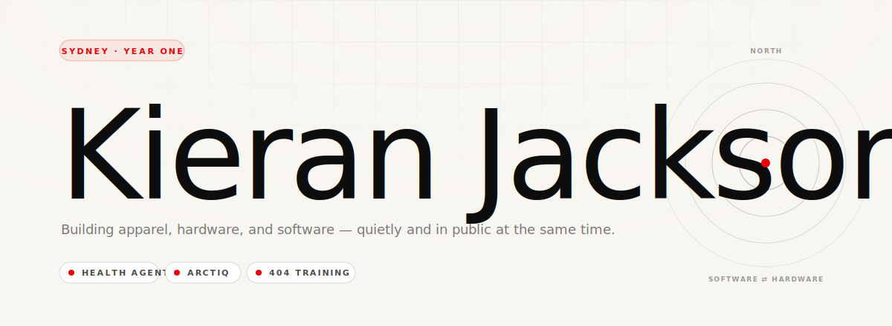

  

  
  
  

 

## Hey

I'm Kieran. I build things across apparel, hardware, and software — usually more than one at a time. This GitHub is the **home of every project I'm making**. Most of the repos stay private while I'm still learning in public-but-quietly. The public ones are the ones someone asked to see.

 

## Now

Fresh out of a Bachelor of Commerce (Finance) at Macquarie · **first full year of doing software professionally**. Self-taught, ramping from frontend into hardware this year. Cerebro was the first firmware drop; Trackman firmware is next. Bambu Labs P2S on the way, more ESP32 kits inbound. Trying more things than ever.

 

## What I'm building

<table>
<tr>
<td width="33%" valign="top">

### Health Agent
**Frontend Developer**
 healthagent.com.au

Pharma patient-assistance programs. Live and operational.

</td>
<td width="33%" valign="top">

### Arctiq Services
**Director · Brand & Strategy**
 arctiqservices.com.au

Refrigeration for the vaccine cold chain. Black-box fridge monitors shipping now, next-gen compression R&D with Melbourne Uni.

</td>
<td width="33%" valign="top">

### 404 Training
**Co-Founder · Technical Director**
 404training.com

Apparel + hardware brand. Cerebro was the first firmware drop.

</td>
</tr>
</table>

 

## Public on GitHub

| Repo | What it is |
|---|---|
| [**cerebro-firmware**](https://github.com/KezLahd/cerebro-firmware) | ESP32-S3 firmware for the Cerebro voice-capture device — animated face, BLE pairing, Wi-Fi HTTP API, dual-codec audio |

More may come public as projects graduate out of "learning" and into "ready to show." The rest stay private on purpose — not because they're secret, because they're not good yet.

 

## What I build with

  
  
  
  
  

  
  
  
  
  

  
  
  
  
  

 

## Reach me

  
  
  

 

---

  Sydney · 2026 · <b>Most repos private.</b> The public ones are the ones you asked to see.

